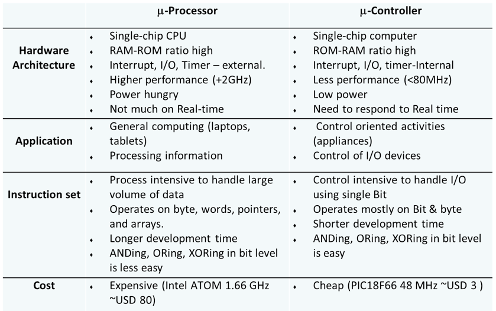

# Tutorial 1

## Q1
### (i). What are the main components of a microcontroller?
#### Answer:
CPU, I/O, Bus, Memory

### (ii).What is the difference between a microcontroller and a microprocessor?
#### Answer:

### (iii). Name 5 criteria for selecting a specific microcontroller for a project. 
#### Answer:
a.	I/O requirement:

	i.	Number of general purpose I/O ports/pins
	ii.	Special interfaces (UART, A/D, D/A)

b.	Size of RAM and ROM (type of ROM)

c.	On-chip peripherals (timers, counters)

d.	Speed requirement

e.	Cost

f.	Availability (now and future)

g.	Development support:

	i.	Assembler, compiler, linker
	ii.	Debugging tools
	iii.	Support from manufacturer and users (forums)

### (iv). Compare machine language, assembly language, and high-level language.
#### Answer: 
Machine language – binary code, directly understood by the CPU. 

Assembly language – mnemonic representation of the binary code, a one-to-one direct translation (assemble) to the binary code. 

High-level language – more human-readable instruction and easy-to-understand programming concept (if-then-else, and loops), one instruction normally translates (compiles) to multiple binary instructions.

### (v). Compare address bus and data bus.
#### Answer: 
Address bus – to send (from CPU) the address of the memory requested to the memory module, unidirectional. 

Data bus – to send or receive binary data, bidirectional. 

### (vi). Compare RAM, EEPROM, and Flash in terms of volatility, rewriting speed, and uses.
#### Answer: 
Data RAM – volatile, instant rewrite, store data. 

EEPROM – non-volatile, slow in rewriting, store data/program. 

Flash – non-volatile, reasonably fast in rewriting, store program.

